# Collaborative Knowledge Workspace (CKW)

A modern, distributed microservices-based collaborative document editing platform. This workspace enables real-time collaboration on documents with a robust backend architecture supporting user management, authentication, workspace management, and page persistence.

## Project Overview

Collaborative Knowledge Workspace is built using a microservices architecture with the following components:

- **API Gateway**: Entry point for all client requests using Spring Cloud Gateway
- **Auth Service**: Authentication and authorization using JWT tokens
- **User Service**: User management and profile operations
- **Page Service**: Document/page storage and retrieval with R2DBC reactive database
- **Workspace Service**: Workspace management and organization
- **Collaboration Service**: Real-time collaborative editing using Hocuspocus and Yjs
- **UI**: React-based frontend with Vite and TanStack Router

## Architecture



### Key Components Documentation
- [API Gateway](./api-gateway/README.md)
- [Auth Service](./auth-service/README.md)
- [Collaboration Service](./collaboration-service/README.md)
- [Workspace Service](./workspace-service/README.md)


## Technology Stack

### Backend Services
- **Java 25** with Spring Boot 3.5.x
- **Spring Data JPA** for ORM
- **Spring Data R2DBC** for reactive database access
- **Spring Security** with JWT authentication
- **gRPC** for service-to-service communication
- **Redis** for caching and session management
- **PostgreSQL** as primary database
- **Flyway** for database migrations

### Frontend
- **React 18+** with TypeScript
- **Vite** as build tool
- **TanStack Router** for client-side routing
- **TanStack React Query** for data fetching
- **TipTap** as rich text editor
- **Tiptap Collaboration** for collaborative editing
- **ProseMirror** document model
- **Tailwind CSS** for styling
- **Radix UI** for accessible components

### Collaboration
- **Hocuspocus** for WebSocket-based real-time sync
- **Yjs** for CRDT-based conflict-free data sharing

## Services

### 1. API Gateway
The entry point for all HTTP requests, handling routing, load balancing, and request transformation.

**Location**: `./api-gateway`

**Technologies**: Spring Cloud Gateway, Spring gRPC, Spring Boot 3.5.7

**Key Features**:
- HTTP request routing
- Protocol conversion (HTTP to gRPC)
- Load balancing

**See**: [API Gateway README](./api-gateway/README.md)

---

### 2. Auth Service
Handles user authentication, token generation, and authorization checks.

**Location**: `./auth-service`

**Technologies**: Spring Security, JWT, Spring Data JPA, PostgreSQL, Redis

**Key Features**:
- User registration and login
- JWT token generation and validation
- Session management
- Role-based access control

**See**: [Auth Service README](./auth-service/README.md)

---

### 3. User Service
Manages user profiles and user-related operations.

**Location**: `./user-service`

**Technologies**: Spring Boot, Spring Data JPA, gRPC, PostgreSQL, Redis

**Key Features**:
- User profile management
- User metadata storage
- Service-to-service user lookups via gRPC

**See**: [User Service README](./user-service/README.md)

---

### 4. Page Service
Manages document/page storage, retrieval, and persistence with reactive database operations.

**Location**: `./page-service`

**Technologies**: Spring WebFlux, R2DBC, Kafka, PostgreSQL, Flyway

**Key Features**:
- Reactive page storage and retrieval
- Page versioning and snapshots
- Event publishing for collaboration updates
- Database schema management with Flyway

**See**: [Page Service README](./page-service/README.md)

---

### 5. Workspace Service
Manages workspace organization, collaboration spaces, and access control.

**Location**: `./workspace-service`

**Technologies**: Spring Boot, Spring Data JPA, gRPC, PostgreSQL, Redis

**Key Features**:
- Workspace creation and management
- Workspace member management
- Workspace-level permissions

**See**: [Workspace Service README](./workspace-service/README.md)

---

### 6. Collaboration Service
Provides real-time collaborative editing capabilities using WebSockets.

**Location**: `./collaboration-service`

**Technologies**: Bun, TypeScript, Hocuspocus, Yjs, Redis, Axios

**Key Features**:
- Real-time document synchronization
- Conflict resolution using CRDTs
- WebSocket connection management
- ProseMirror document format support

**See**: [Collaboration Service README](./collaboration-service/README.md)

---

### 7. UI (Frontend)
React-based single-page application for end-user interaction.

**Location**: `./ui`

**Technologies**: React 18+, TypeScript, Vite, TanStack Router, TanStack Query, TipTap

**Key Features**:
- Document editing interface
- Real-time collaboration UI
- Workspace and user management pages
- Responsive design with Tailwind CSS

**See**: [UI README](./ui/README.md)

---

## Getting Started

### Prerequisites

- Java 25+ (for backend services)
- Node.js 18+ (for frontend)
- Bun 1.x+ (for collaboration service)
- PostgreSQL 14+
- Redis 6+
- Kafka (optional, for event streaming)
- Docker & Docker Compose (for containerized deployment)

### Quick Start - Local Development

1. **Clone the repository**
   ```bash
   git clone <repository-url>
   cd collab-knowledge-workspace
   ```

2. **Start dependencies** (PostgreSQL, Redis, Kafka)
   ```bash
   docker-compose up -d
   ```

3. **Build and run backend services**
   ```bash
   # API Gateway
   cd api-gateway
   ./gradlew bootRun

   # Auth Service (in another terminal)
   cd auth-service
   ./gradlew bootRun

   # User Service
   cd user-service
   ./gradlew bootRun

   # Page Service
   cd page-service
   ./gradlew bootRun

   # Workspace Service
   cd workspace-service
   ./gradlew bootRun
   ```

4. **Start collaboration service**
   ```bash
   cd collaboration-service
   bun run dev
   ```

5. **Start frontend**
   ```bash
   cd ui
   npm install
   npm run dev
   ```

### Configuration

Each service has its own configuration. See individual service READMEs for configuration details.

Common environment variables:
- `DATABASE_URL`: PostgreSQL connection string
- `REDIS_URL`: Redis connection string
- `JWT_SECRET`: Secret for JWT token signing
- `PORT`: Service port (default varies by service)

## Development

### Building

```bash
# Build all services
./gradlew build  # For Java services

# Build collaboration service
cd collaboration-service && bun build src/index.ts

# Build UI
cd ui && npm run build
```

### Testing

```bash
# Test Java services
./gradlew test

# Test UI
cd ui && npm test
```

### Database Migrations

Page Service uses Flyway for migrations. Run migrations automatically on service startup or manually:

```bash
cd page-service
./gradlew flywayMigrate
```

## Deployment

### Docker Deployment

Each service includes a `Dockerfile`. Build and deploy with Docker Compose:

```bash
docker-compose up --build
```

See individual service READMEs for specific deployment instructions.

## API Documentation

### Manual Tests

HTTP request examples are available in `./manual-tests/` directory:
- Auth Service endpoints: `./manual-tests/auth-service/`
- User Service endpoints: `./manual-tests/user-service/`

### API Gateway

The API Gateway routes requests to backend services. Default endpoints:
- `POST /auth/register` - Register new user
- `POST /auth/login` - User login
- `GET /users/{id}` - Get user info
- `GET /pages/{id}` - Get page content
- `POST /pages` - Create new page
- `GET /workspaces/{id}` - Get workspace info

## Contributing

1. Create a feature branch
2. Make your changes
3. Write tests
4. Submit a pull request

## Project Structure

```
collab-knowledge-workspace/
├── README.md (this file)
├── api-gateway/              # Spring Cloud Gateway
├── auth-service/             # Authentication service
├── collaboration-service/    # Real-time sync service (Bun)
├── page-service/             # Page persistence service
├── ui/                        # React frontend
├── user-service/             # User management service
├── workspace-service/        # Workspace management service
└── manual-tests/             # HTTP request examples
```

## License

[Add your license here]

## Support

For issues, questions, or contributions, please [add your contact/issue tracking info here].

